# 1. Jenkins 설치

모든 코드는 [Github](https://github.com/jojoldu/jenkins-beanstalk-multi-module)에 있습니다.


## 1-1. IAM Role 생성

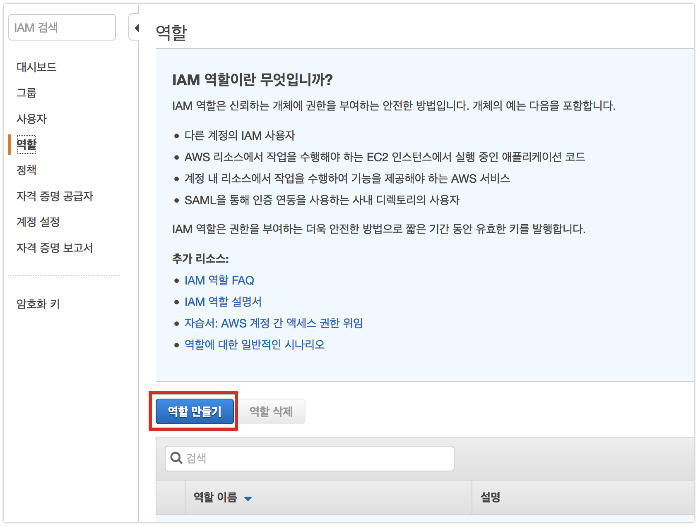

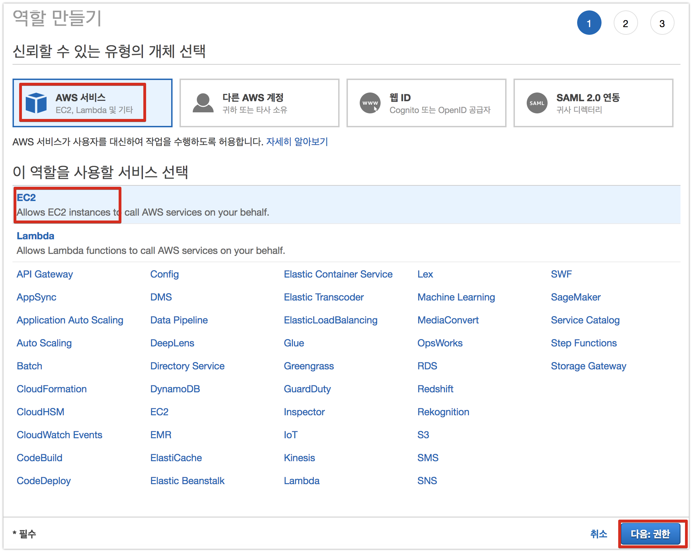

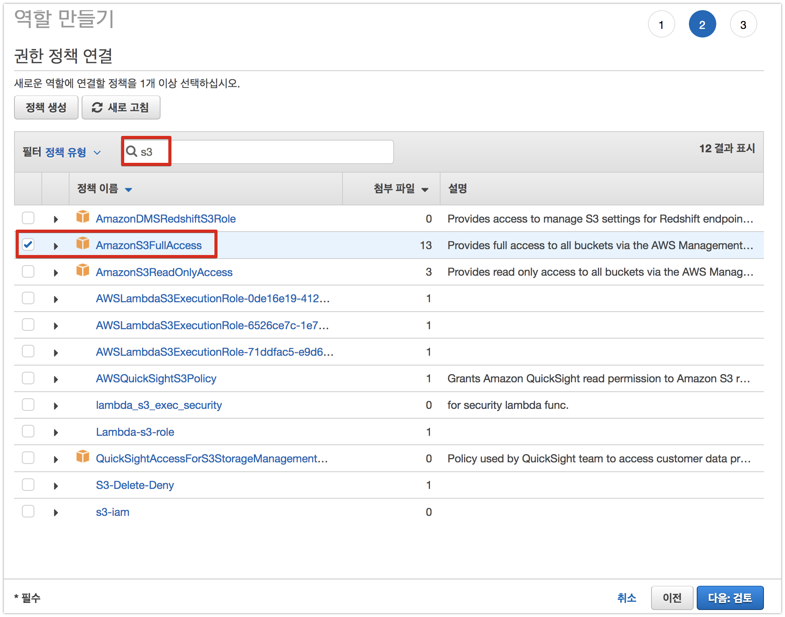

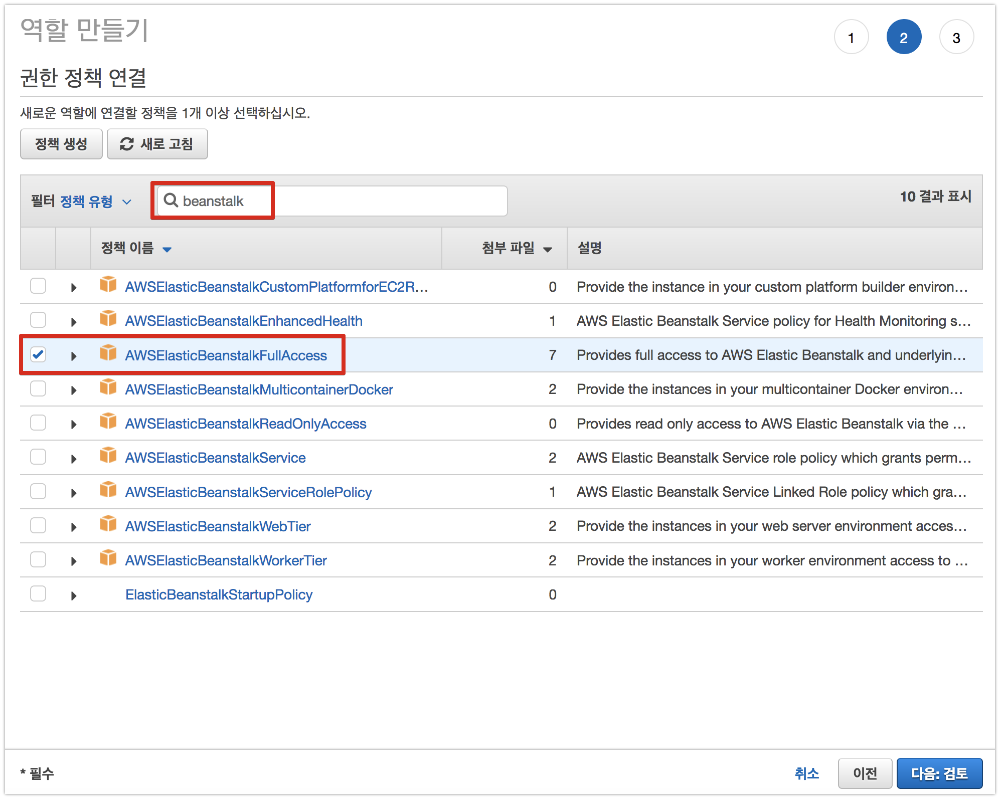

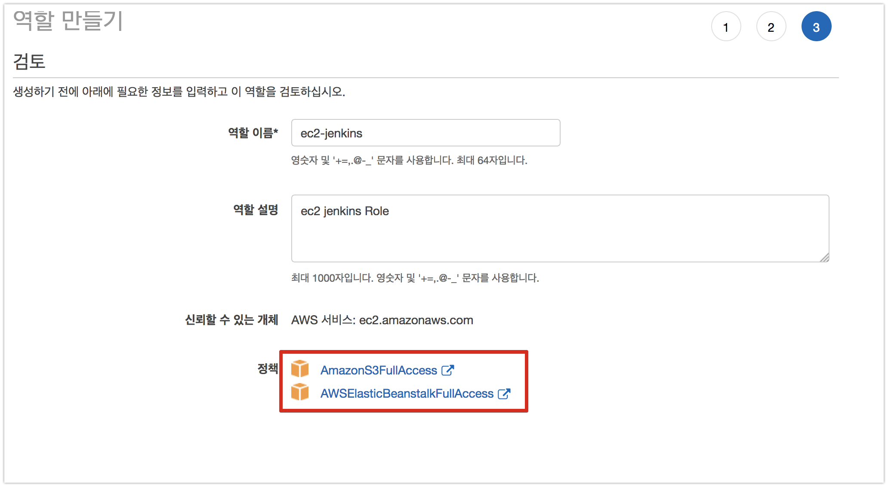

## 1-2. EC2 생성

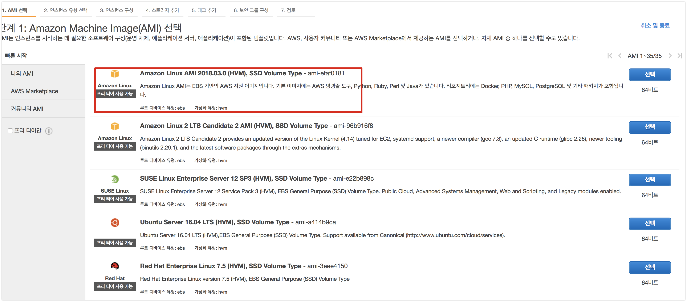

## 1-3. EC2에 Jenkins & Nginx 설치

```bash
sudo yum update
```

[Java 8 설치](http://jojoldu.tistory.com/261)

```bash
sudo yum install git
```

jenkins 설정 파일을 받습니다.

```bash
sudo wget -O /etc/yum.repos.d/jenkins.repo https://pkg.jenkins.io/redhat-stable/jenkins.repo
```

key를 import 합니다.

```bash
sudo rpm --import https://pkg.jenkins.io/redhat-stable/jenkins.io.key
```

jenkins를 설치합니다.

```bash
sudo yum install jenkins
```

jenkins를 실행합니다.

```bash
sudo service jenkins start
```

잘 실행되었는지도 한번 확인합니다.

```bash
# 상태 확인
sudo service jenkins status

# 실제 url 호출
curl localhost:8080
```

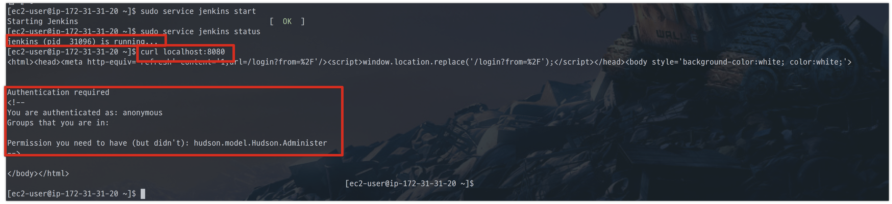

현재 저희가 생성한 EC2는 80, 443 포트만 열어두었습니다.  
그래서 외부에서 접근하려면 80, 443 으로만 가능한대요.  
jenkins의 경우 기본 포트가 8080으로 잡힙니다.  
이를 80포트에서도 붙을수 있도록 변경해야합니다.  
크게 2가지 방법이 있습니다.

* jenkins의 기본 포트를 8080 -> 80으로 변경한다
* 웹서버 (Apache, Nginx)를 같이 설치해 웹서버(80포트)가 Jenkins(8080포트)로 프록시 하도록 한다.

여기서 저는 2번째 방법을 사용하겠습니다.  
웹서버를 중간에 두면, 여러모로 활용처가 많습니다.  
(예를 들어, jenkins로 실행한 Test 결과 HTML을 Nginx를 통해 접근한다던지)  
  
자 그럼 Nginx도 설치합니다.

```bash
sudo yum install nginx
```

설치가 완료되셨으면 Nginx 설정을 수정합니다.

```bash
# config 파일 열기
sudo vim /etc/nginx/nginx.conf
```

아래와 같이 ```location /```에 내용을 추가합니다.

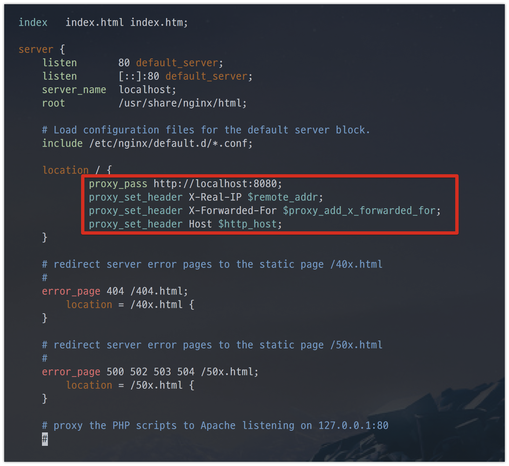

```bash
proxy_pass http://localhost:8080;
proxy_set_header X-Real-IP $remote_addr;
proxy_set_header X-Forwarded-For $proxy_add_x_forwarded_for;
proxy_set_header Host $http_host;
```

수정이 완료 되셨으면 저장(```:wq```) 하신뒤, nginx를 실행합니다.

```bash
sudo service nginx start
```

자 그럼 이제 Nginx가 jenkins로 프록시를 잘해주는지 확인합니다.

```bash
curl localhost
```

(8080포트가 아닌 80포트로 요청!)

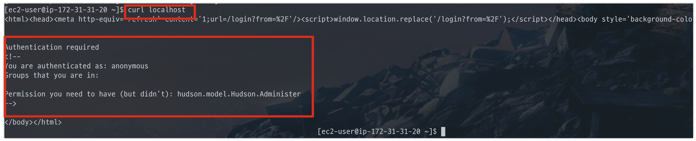

8080이 아닌 80포트로 요청을 해도 좀 전의 jenkins 요청때와 마찬가지로 결과가 오는걸 확인했습니다!  
본격적으로 Jenkins 설치 과정을 시작하겠습니다.

## 1-4. Jenkins 설치

EC2의 퍼블릭 IP로 접근해봅니다.

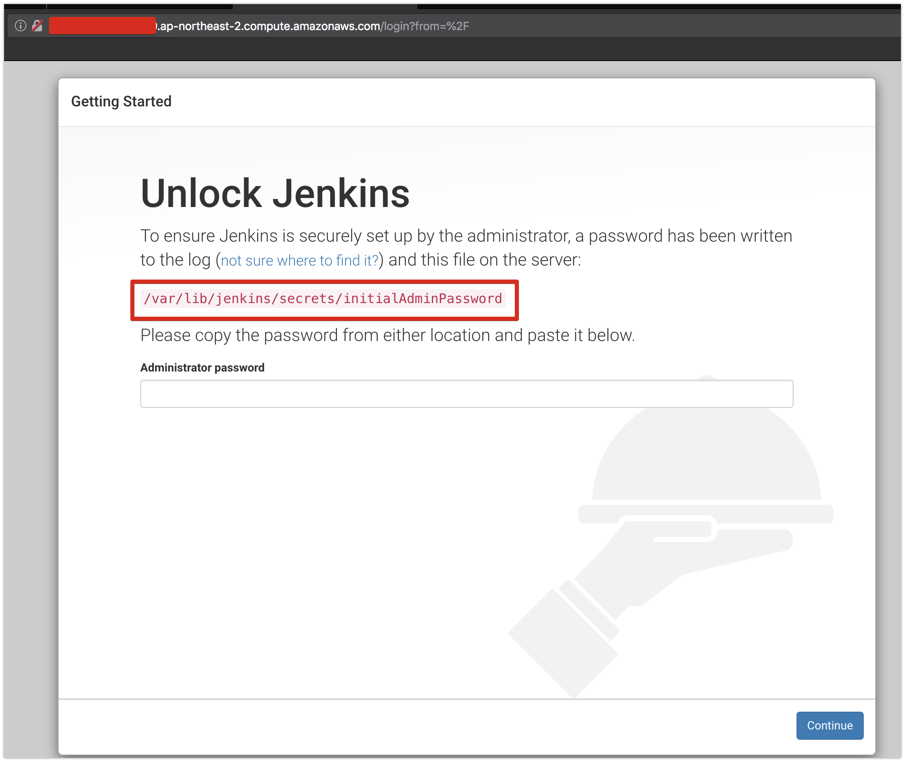

jenkins의 관리자 비밀번호를 입력해야하는데요.  
화면에 나온 위치(```/var/lib/jenkins/secrets/initialAdminPassword```)에 있는 코드를 그대로 복사해서 넣으시면 됩니다.  
jenkins가 설치된 ec2에 아래 명령어를 입력해서 코드를 확인합니다.

```bash
sudo cat /var/lib/jenkins/secrets/initialAdminPassword
```

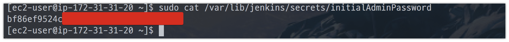

다음 과정에서 플러그인은 추천 플러그인 설치를 선택합니다.


플러그인들이 설치될때까지 잠깐 기다립니다.

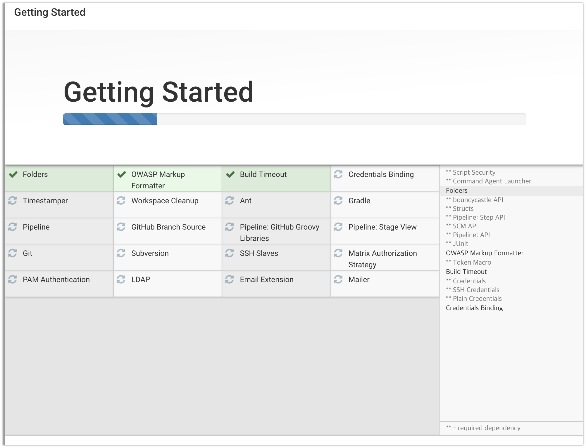

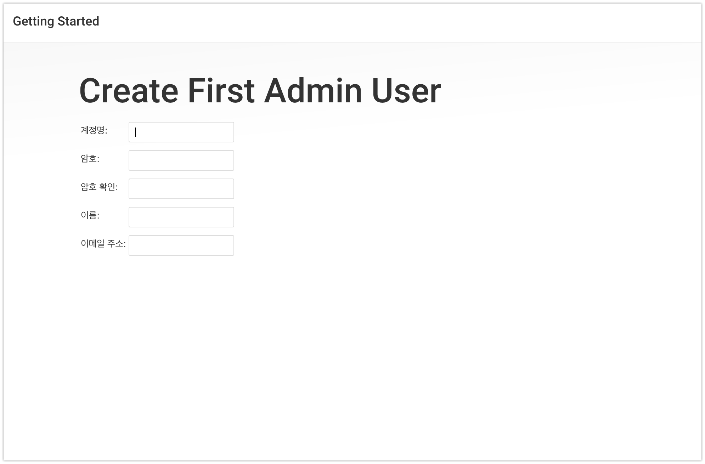

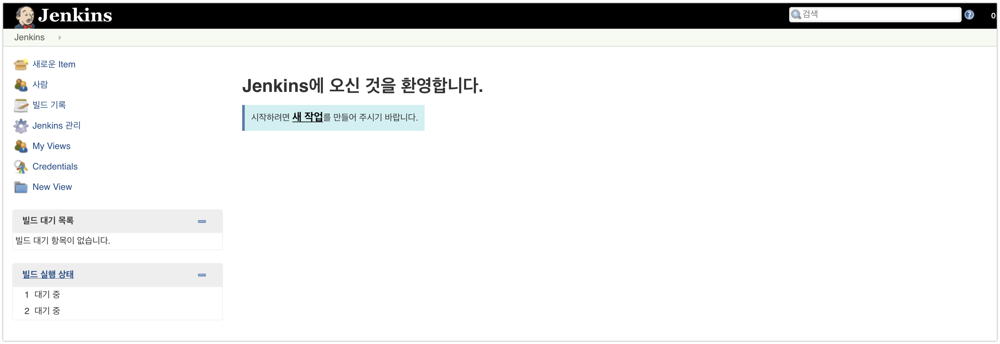

jenkins 설치가 끝났습니다!  
다음 시간에는 jenkins와 Github을 연동하는 방법을 소개드리겠습니다.

