# 1. Jenkins 설치

팀내 신규 구축 되는 시스템의 배포 환경을 Jenkins + [AWS Beanstalk](http://pyrasis.com/book/TheArtOfAmazonWebServices/Chapter23)으로 진행하게 되었습니다.  
저는 AWS Beanstalk을 한번도 사용해본적이 없는데요.  
그래서 어떻게 배포하면 될지 연습하게 되었습니다.  
  
오토 스케일링 그룹, 로드밸런싱 등등을 신경쓰지 않고 서비스 하시려는 분들께 도움이 될것 같습니다.  
이번 포스팅은 하나의 프로젝트를 Jenkins + Beanstalk으로 배포하는게 아닌, [Gradle Multi Project에서 배포](http://jojoldu.tistory.com/123)하는 과정입니다.  
  
모든 코드는 [Github](https://github.com/jojoldu/jenkins-beanstalk-multi-module)에 있으니 참고하시면 될것 같습니다.  

## 1-1. IAM Role 생성

가장 먼저 IAM Role을 생성하겠습니다.  
AWS에서 IAM 서비스를 선택하시고 역할 만들기를 선택합니다.


**Jenkins가 설치될 EC2에서 S3와 Beanstalk에 접근**할 수 있어야 하기 때문에 서비스는 EC2를 선택합니다.


정책은 2가지를 선택해야합니다.

* S3FullAccess
* BeanstalkFullAccess


역할의 이름과 설명을 추가하신뒤 최종 생성 완료 하시면 됩니다.


> Role (역할)은 일종의 권한이라고 생각하시면 됩니다.  
EC2에서 S3와 Beanstalk에 접근하고, 파일을 읽고, 업로드 할 수 있는 권한을 생성한 것입니다.

## 1-2. EC2 생성

IAM Role이 생성되었으니, Jenkins가 설치될 EC2를 생성하겠습니다.  
Amazon Linux AMI를 선택합니다.


프리티어를 선택하시고,

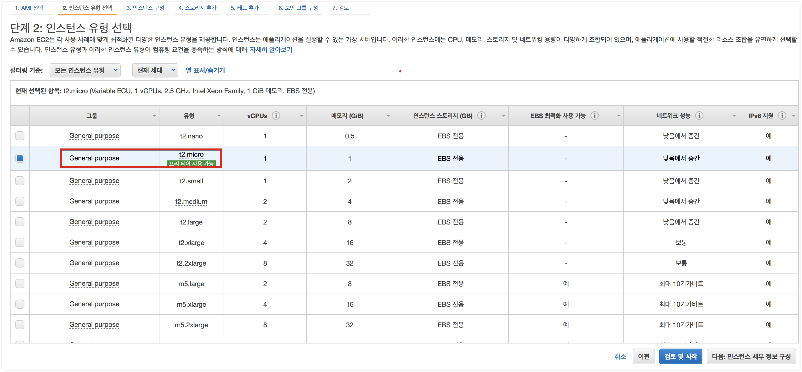

다른 옵션들은 다 기본으로 선택하시면 됩니다.

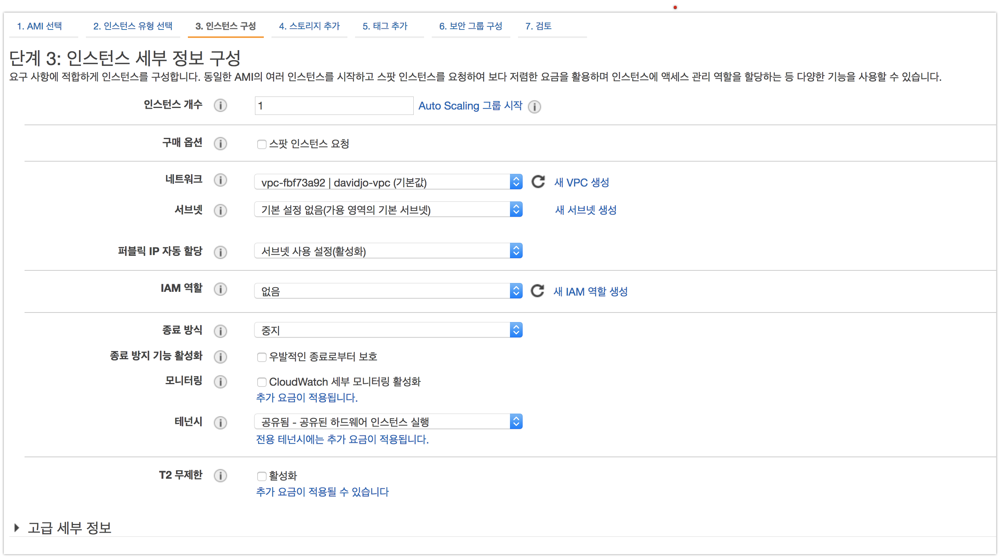

스토리지는 8GB로 되있을텐데요.  
프리티어에선 30GB까지 지원하니 30GB로 변경합니다.

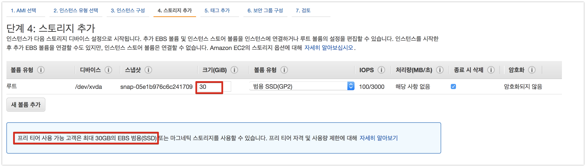

Name 태그는 EC2 용도를 나타낼 수 있는 이름으로 등록합니다.

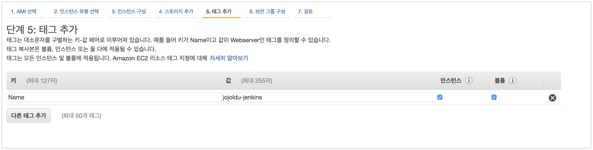

보안그룹은 총 3개를 등록합니다.

* SSH: 22포트
* HTTP: 80 포트
* HTTPS: 443 포트
 
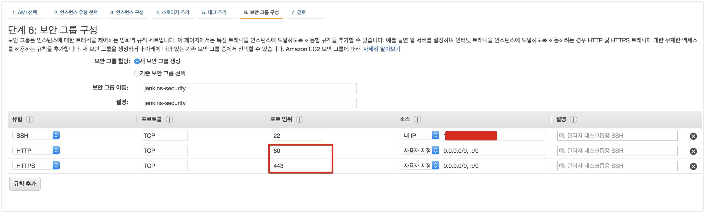

키 페어의 경우에 기존에 쓰던게 있어서 저는 기존 키페어를 선택했습니다.  
처음이신분이라면 새로 생성해서 받으시면 됩니다.

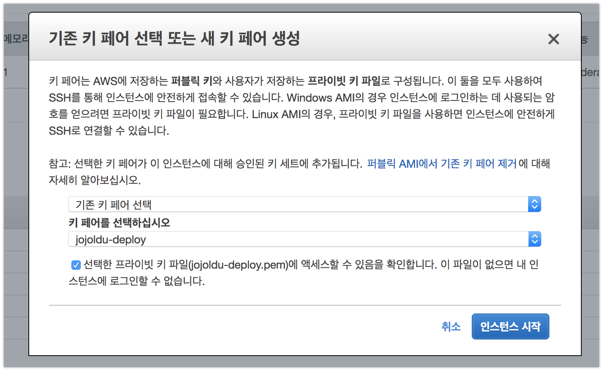

이렇게 EC2가 완성 되셨으면, **고정 IP를 받기 위해** 탄력적 IP 탭을 클릭합니다.

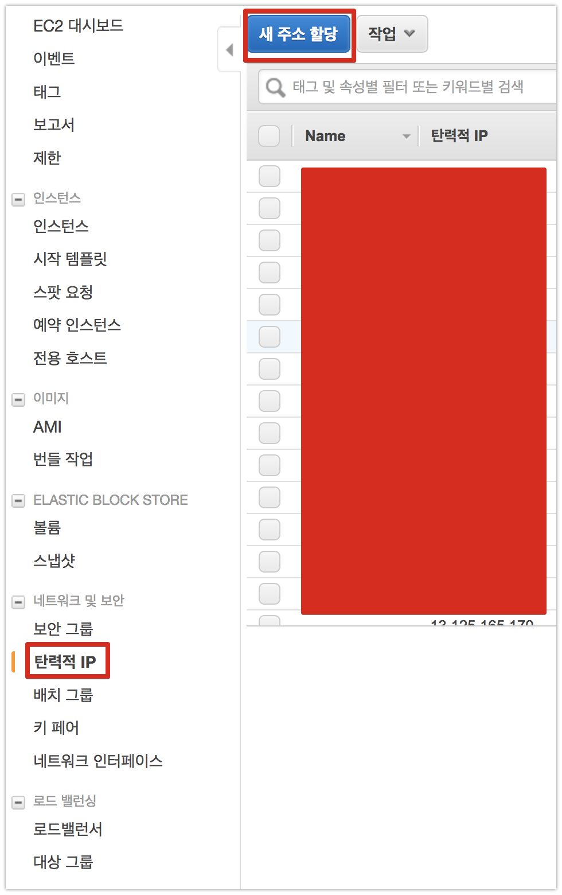

새 IP를 생성하고

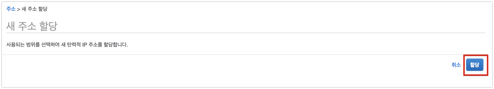

생성된 IP를 확인합니다.

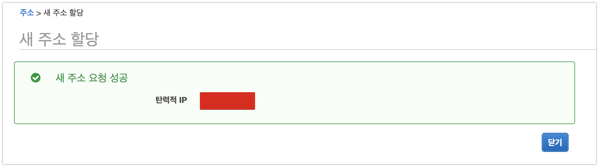

해당 탄력적 IP를 **우클릭**하시면 메뉴가 보이는데요.  
여기서 EC2와 연결을 위해 **주소 연결**을 클릭합니다.

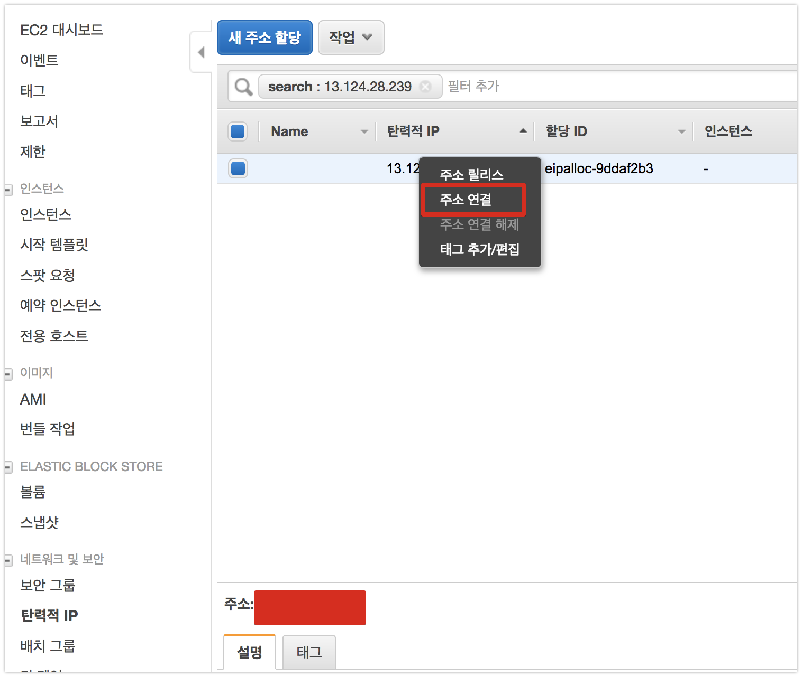

그리고 좀전에 생성한 EC2를 선택해서 연결합니다.

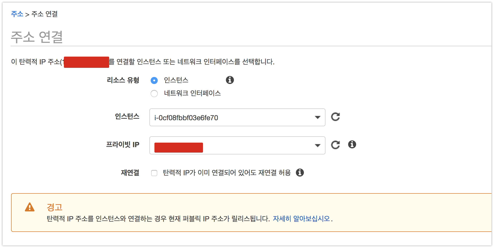

인스턴스와 탄력적 IP가 잘 연결되었음을 확인합니다.

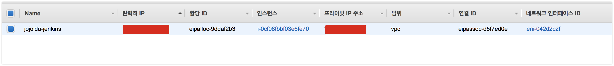

자 이제 AWS 작업이 완료되었습니다!  
본격적인 Jenkins 설치 과정을 진행하겠습니다.

## 1-3. Jenkins 설치파일 받기 & Nginx 설치

생성된 EC2로 접속합니다.

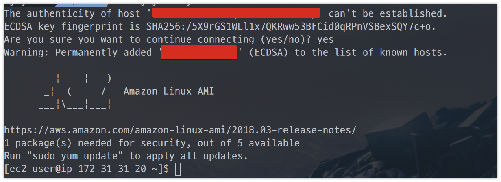

먼저 패키지 업데이트를 진행하겠습니다.

```bash
sudo yum update
```

패키지 업데이트 끝나셨으면 Java 8을 설치해야하는데요.  
(Amazon Linux의 기본 Java는 7입니다.)  
  
이 과정은 이전에 작성한 [포스팅](http://jojoldu.tistory.com/261)을 참고하시면 되겠습니다.  
  
Java8 설치도 끝나셨으면, git도 같이 설치합니다.

```bash
sudo yum install git
```

기본적인 작업은 끝이났습니다.  
이제 Jenkins 설치 파일을 받겠습니다.

```bash
sudo wget -O /etc/yum.repos.d/jenkins.repo https://pkg.jenkins.io/redhat-stable/jenkins.repo
```

여기에 Jenkins key를 import 합니다.

```bash
sudo rpm --import https://pkg.jenkins.io/redhat-stable/jenkins.io.key
```

받은 설치파일을 통해 Jenkins를 설치합니다.

```bash
sudo yum install jenkins
```

jenkins를 실행합니다.

```bash
sudo service jenkins start
```

잘 실행되었는지도 한번 확인합니다.

```bash
# 상태 확인
sudo service jenkins status

# 실제 url 호출
curl localhost:8080
```


현재 저희가 생성한 EC2는 80, 443 포트만 열어두었습니다.  
그래서 외부에서 접근하려면 80, 443 으로만 가능한대요.  
Jenkins의 경우 기본 포트가 8080으로 잡힙니다.  
이를 80포트에서도 붙을수 있도록 변경해야합니다.  
크게 2가지 방법이 있습니다.

* Jenkins의 기본 포트를 8080 -> 80으로 변경한다
* 웹서버 (Apache, Nginx)를 같이 설치해 웹서버(80포트)가 Jenkins(8080포트)로 프록시 하도록 한다.

여기서 저는 2번째 방법을 사용하겠습니다.  
웹서버를 중간에 두면, 여러모로 활용처가 많습니다.  
(예를 들어, Jenkins로 실행한 Test 결과 HTML을 Nginx를 통해 접근한다던지)  
  
자 그럼 Nginx도 설치합니다.

```bash
sudo yum install nginx
```

설치가 완료되셨으면 Nginx로 들어온 Request를 Jenkins로 Proxy 할 수 있도록 설정을 수정합니다.

```bash
# config 파일 열기
sudo vim /etc/nginx/nginx.conf
```

아래와 같이 ```location /```에 내용을 추가합니다.


```bash
proxy_pass http://localhost:8080;
proxy_set_header X-Real-IP $remote_addr;
proxy_set_header X-Forwarded-For $proxy_add_x_forwarded_for;
proxy_set_header Host $http_host;
```

수정이 완료 되셨으면 저장(```:wq```) 하신뒤, nginx를 실행합니다.

```bash
sudo service nginx start
```

자 그럼 이제 Nginx가 jenkins로 프록시를 잘해주는지 확인합니다.

```bash
curl localhost
```

(8080포트가 아닌 80포트로 요청!)


8080이 아닌 80포트로 요청을 해도 좀 전의 jenkins 요청때와 마찬가지로 결과가 오는걸 확인했습니다!  
본격적으로 Jenkins 설치 과정을 시작하겠습니다.

## 1-4. Jenkins 설치

EC2의 퍼블릭 IP로 접근해봅니다.  
그럼 아래와 같이 Jenkins의 관리자 비밀번호를 입력하라는 페이지가 열립니다.


화면에 나온 위치(```/var/lib/jenkins/secrets/initialAdminPassword```)에 있는 코드를 그대로 복사해서 넣으시면 됩니다.  
Jenkins가 설치된 EC2에 아래 명령어를 입력해서 코드를 확인합니다.

```bash
sudo cat /var/lib/jenkins/secrets/initialAdminPassword
```


비밀번호를 입력한뒤, 추천 플러그인 설치를 선택합니다.


플러그인들이 설치될때까지 잠깐 기다립니다.


관리자 계정 정보를 등록합니다.


모든 과정이 끝이나면 아래와 같이 Jenkins 페이지로 접근할 수 있게 됩니다.


Jenkins 설치가 끝났습니다!  
다음 시간에는 Jenkins와 Github을 연동하는 방법을 소개드리겠습니다.

