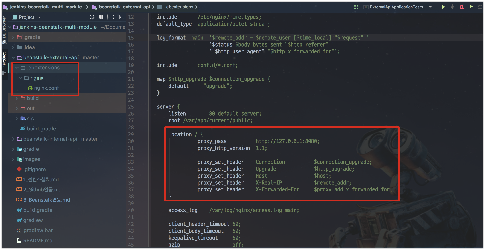
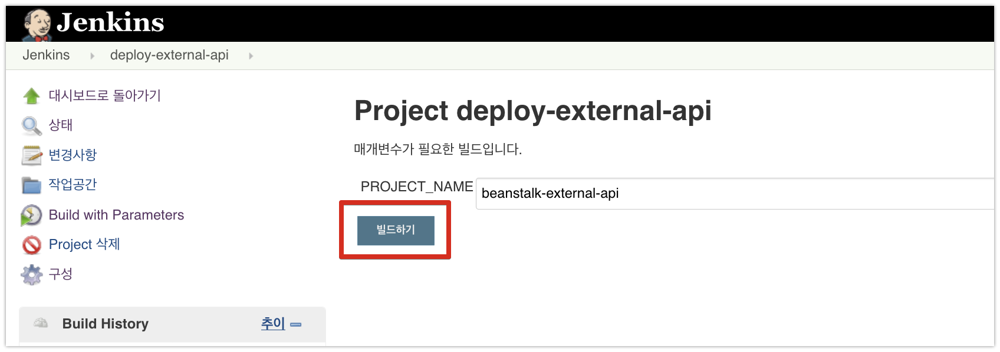
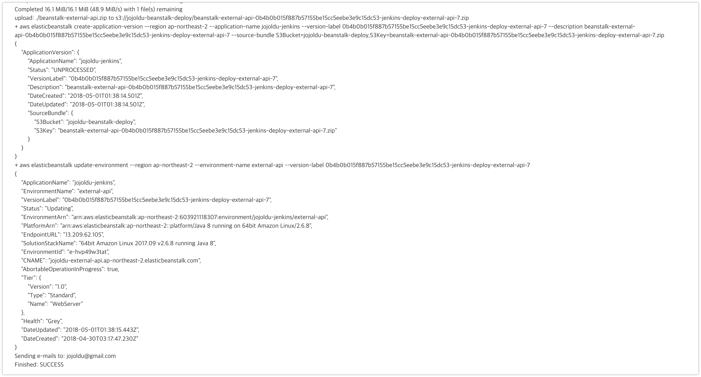
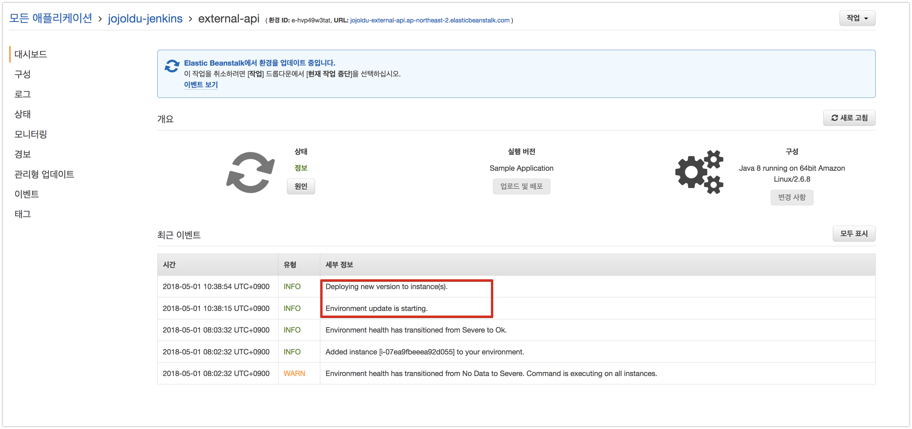
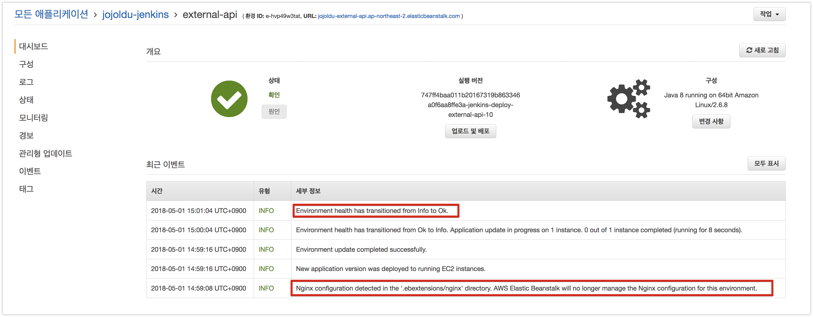
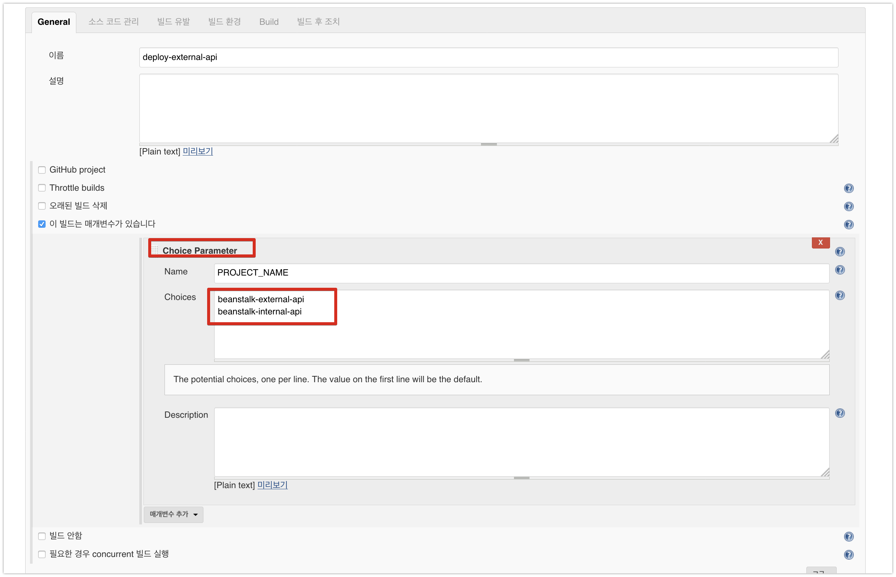
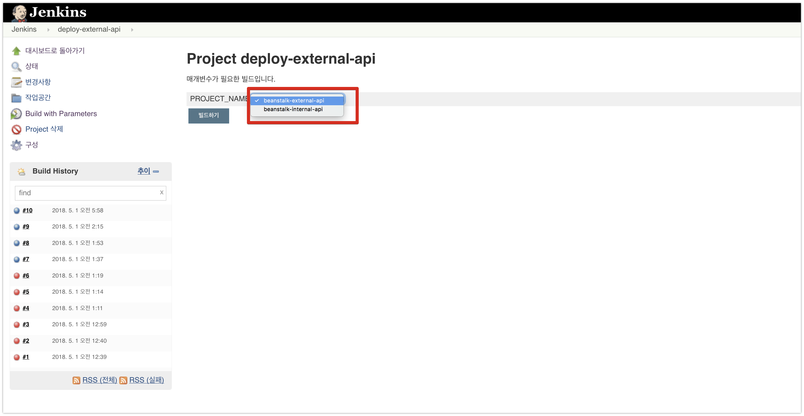

# 3. Beanstalk 연동하기

이번 시간에는 지난 시간에 구축한 Jenkins로 Beanstalk을 연동해보겠습니다.  

## 3-1. Beanstalk 생성

서비스에서 Beanstalk을 검색해서 Beanstalk 서비스 페이지로 이동합니다.


우측 최상단의 **새 어플리케이션 생성** 버튼을 클릭합니다.  
  
어플리케이션의 이름과 설명을 작성합니다.


생성된 어플리케이션에서 환경을 생성합니다.


> 참고로 어플리케이션이 상위의 그룹입니다.  
즉, 어플리케이션 안에 환경이 있습니다.

환경 티어에서는 **웹 서버 환경**을 선택합니다.  


환경의 상세 정보를 등록해야하는데요.  
여기서 저는 도메인과 환경 이름을 external-api라고 정했습니다.  


이렇게 한 이유는 간단합니다.  
이번 주제가 [Gradle Multi Module](http://jojoldu.tistory.com/123) 기반에서 Beanstalk을 어떻게 배포하느냐이기 때문입니다.  
현재 제가 배포할 프로젝트는 아래와 같이 프로젝트 하나에 서브 모듈 2개로 구성되어있습니다.  


이들은 **각각 별도의 서버에 배포**되어서 서비스 되야 합니다.  
(external-api는 외부제공용 API, internal-api는 내부에서 사용할 API정도로 보시면 됩니다.)  
  


> 요즘 대부분의 프로젝트가 이런식으로 도메인을 구성하는 여러 프로젝트를 한곳에서 관리하되, 배포는 각각 별도의 서버로 하고 있으니 한번 경험삼아 구축해보시는것을 추천드립니다.

이번에 만들 Beanstalk은 **external-api가 배포될 환경**이라고 보시면 됩니다.  
Java를 선택하시고, 샘플 애플리케이션을 선택하신뒤 환경생성을 완료합니다.  
상태가 **확인**으로 뜨면 정상적으로 구축된 것입니다.


자 그럼 이렇게 구축된 Beanstalk 환경과 이전에 구축된 Jenkins를 연동하겠습니다.

## 3-2. Jenkins & Beanstalk 연동

전체 연동 구성은 아래와 같습니다.


Jenkins에서는 Beanstalk과 연동하기 위해 2개의 기능이 추가되어야 합니다.

* Build 결과물인 Jar를 S3에 Upload
* S3에 업로드된 Jar를 이용해 배포하라는 명령을 Beanstalk에 전달

그럼 Jar를 업로드할 S3를 먼저 생성하겠습니다.

### S3 생성

서비스에서 S3를 검색해서 이동하신뒤, **버킷 만들기**를 클릭합니다.


이후 차례로 값을 입력하면서 생성하시면 됩니다.


### Jenkins 빌드 추가

S3까지 준비되었으니, 실제 배포를 위한 Jenkins Item을 생성하겠습니다.


PROJECT_NAME 으로 지정된 값은 하단의 Build 과정에서 사용할 예정입니다.  


(전체 코드는 아래에 있습니다.)

```bash
# Build
./gradlew :${PROJECT_NAME}:clean build

# Zip
cd ${PROJECT_NAME}/build/libs
cp -r ../../.ebextensions .ebextensions
mv *.jar application.jar
zip -r ${PROJECT_NAME}.zip application.jar .ebextensions

# Upload S3
aws s3 cp ${PROJECT_NAME}.zip s3://jojoldu-beanstalk-deploy/${PROJECT_NAME}-${GIT_COMMIT}-${BUILD_TAG}.zip \
--acl public-read-write \
--region ap-northeast-2

# Execute Beanstalk
aws elasticbeanstalk create-application-version \
--region ap-northeast-2 \
--application-name jojoldu-jenkins \
--version-label ${GIT_COMMIT}-${BUILD_TAG} \
--description ${PROJECT_NAME}-${GIT_COMMIT}-${BUILD_TAG} \
--source-bundle S3Bucket="jojoldu-beanstalk-deploy",S3Key="${PROJECT_NAME}-${GIT_COMMIT}-${BUILD_TAG}.zip"

aws elasticbeanstalk update-environment \
--region ap-northeast-2 \
--environment-name external-api \
--version-label ${GIT_COMMIT}-${BUILD_TAG}
```

* ```./gradlew :${PROJECT_NAME}:clean build```
  * 여기서 맨위 매개변수 항목에서 지정한 PROJECT_NAME를 쓰고 있습니다.
  * 이 코드는 결국 ```./gradlew :beanstalk-external-api:clean build``` 로 수행됩니다.
  * 전체 build가 아닌, 배포 대상인 ```beanstalk-external-api```만 build 하기 때문에 build 시간 단축 & 다른 모듈 코드 변경에 영향을 받지 않는 장점이 있습니다.
* Zip
  * ```cd ${PROJECT_NAME}/build/libs```: beanstalk-external-api/build/libs로 이동
  * ```cp -r ../../.ebextensions .ebextensions```: beanstalk-external-api/.ebextensions 디렉토리 전체를 beanstalk-external-api/build/libs/.ebextensions로 복사
  * ```mv *.jar application.jar```: beanstalk-external-api-0.0.1.jar를 application.jar로 이름을 변경
  * ```zip -r ${PROJECT_NAME}.zip application.jar .ebextensions```: .ebextensions 디렉토리 내용과 application.jar를 합쳐서 beanstalk-external-api.zip으로 압축합니다.

여기서 ```.ebextensions```가 뭐지? 라고 생각이 드실텐데요.  
beanstalk은 Nginx 등을 비롯한 서버 환경을 다 담아놓은 서비스입니다.  
그렇다보니, 기본 설정에서 커스텀하게 변경이 필요한 부분들은 ```.ebextensions``` 디렉토리에 conf 파일을 추가해서 사용해야합니다. ([참고](https://docs.aws.amazon.com/ko_kr/elasticbeanstalk/latest/dg/java-se-nginx.html))  
  
여기서는 Nginx의 프록시 포트를 8080으로 변경하기 위한 코드를 추가한 케이스입니다.  
저처럼 배포할 모듈의 하위에 ```.ebextensions/nginx``` 디렉토리를 생성하시고, nginx.conf 파일을 생성합니다.



nginx.conf 파일의 전체 코드는 아래와 같습니다.

```Nginx
user                    nginx;
error_log               /var/log/nginx/error.log warn;
pid                     /var/run/nginx.pid;
worker_processes        auto;
worker_rlimit_nofile    33282;

events {
    worker_connections  1024;
}

http {
  include       /etc/nginx/mime.types;
  default_type  application/octet-stream;

  log_format  main  '$remote_addr - $remote_user [$time_local] "$request" '
                    '$status $body_bytes_sent "$http_referer" '
                    '"$http_user_agent" "$http_x_forwarded_for"';

  include       conf.d/*.conf;

  map $http_upgrade $connection_upgrade {
      default     "upgrade";
  }

  server {
      listen        80 default_server;
      root /var/app/current/public;

      location / {
                proxy_pass          http://127.0.0.1:8080;
                proxy_http_version  1.1;

                proxy_set_header    Connection          $connection_upgrade;
                proxy_set_header    Upgrade             $http_upgrade;
                proxy_set_header    Host                $host;
                proxy_set_header    X-Real-IP           $remote_addr;
                proxy_set_header    X-Forwarded-For     $proxy_add_x_forwarded_for;
      }

      access_log    /var/log/nginx/access.log main;

      client_header_timeout 60;
      client_body_timeout   60;
      keepalive_timeout     60;
      gzip                  off;
      gzip_comp_level       4;

      # Include the Elastic Beanstalk generated locations
      include conf.d/elasticbeanstalk/01_static.conf;
      include conf.d/elasticbeanstalk/healthd.conf;
  }
}
```

이 conf 파일이 beanstalk 배포시점에 같이 적용된다고 보시면 됩니다.  
  
자 그럼 이제 준비가 다 되었으니 한번 배포를 진행해보겠습니다.  



성공적으로 Jenkins Job이 끝난걸 확인하고!



beanstalk 페이지로 가보시면 배포가 진행되는걸 볼 수 있습니다.



beanstalk 배포가 성공적으로 끝난게 확인 되면



(Nginx 설정이 커스텀하게 변경되었음을 로그로 알 수 있습니다.)  


배포가 성공적으로 되어 API가 잘 작동되는걸 확인할 수 있습니다!  
  
자 여기까지 하면 Jenkins + AWS Beanstalk 배포 전체 프로세스가 끝나게 됩니다.

## 3-3. Jenkins 멀티 모듈 배포 추가

Jenkins에서 여러 모듈을 배포해야하기 때문에 deploy Item에 조금 기능을 추가해보겠습니다.  
기존에 등록되있던 매개변수를 string parameter에서 Choice Parameter로 변경합니다.



Name은 그대로 ```PROJECT_NAME```을 선택하시고, choices에선 모듈들의 이름을 **한줄씩**추가합니다.  
각 라인에 적힌 값들이 select box의 항목이 됩니다.  
변경후 저장해서 확인해보시면!



빌드 파라미터가 input box에서 select box로 변경된걸 볼 수 있습니다.  
이렇게 되면, **하위 모듈 배포를 위한 Jenkins Item을 각각 등록할 필요 없이 하나에서 다 진행**할 수 있게 됩니다.
(필요하시면 Jenkins Item 이름도 deploy, 배포 등으로 변경하셔도 됩니다.)  
  
## 마무리

어떠셨나요? 간단하게나마 Jenkins & AWS Beanstalk 배포에 관해 경험해봤습니다.  
EC2에 직접 Nginx를 설치하고, 오토스케일링그룹을 연결하고, 로드밸런서를 설정할 필요 없이 Beanstalk으로 쉽게 해결할수 있기 때문에 개발에만 집중하시기에 좋은 서비스 입니다.  
  
저도 회사에서 사용해보면서 알게되는 팁들을 계속 정리하겠습니다.  
그럼 다음시간에 뵙겠습니다.  
고맙습니다! :)