# 3. Beanstalk 연동하기

이번 시간에는 지난 시간에 구축한 Jenkins로 Beanstalk을 연동해보겠습니다.  

## 3-1. Beanstalk 생성

서비스에서 Beanstalk을 검색해서 Beanstalk 서비스 페이지로 이동합니다.

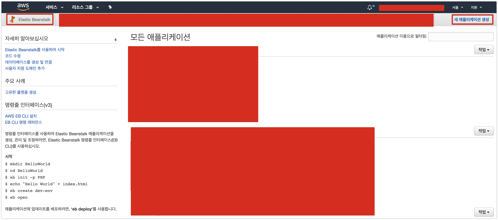

우측 최상단의 **새 어플리케이션 생성** 버튼을 클릭합니다.  
  
어플리케이션의 이름과 설명을 작성합니다.

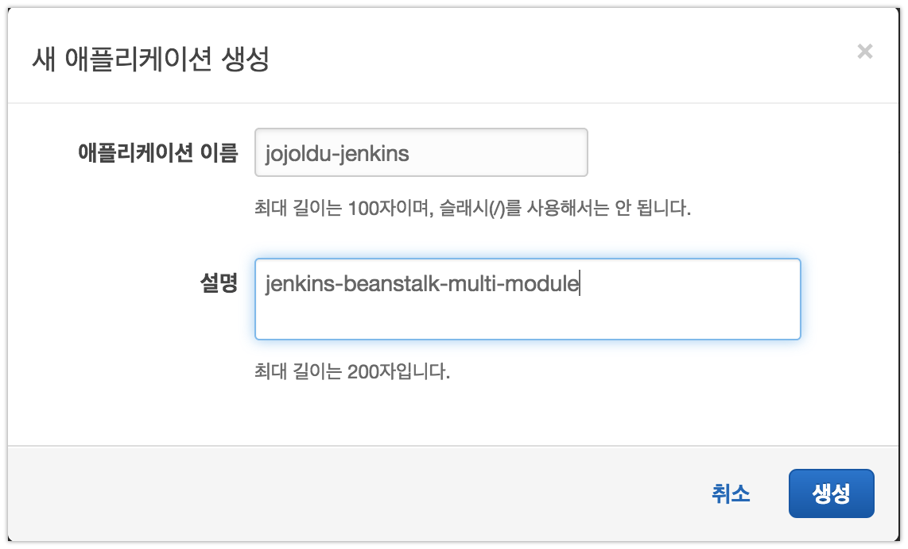

생성된 어플리케이션에서 환경을 생성합니다.

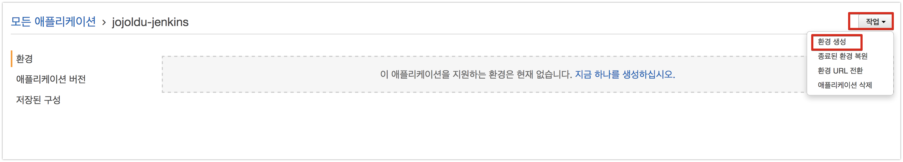

> 참고로 어플리케이션이 상위의 그룹입니다.  
즉, 어플리케이션 안에 환경이 있습니다.

환경 티어에서는 **웹 서버 환경**을 선택합니다.  

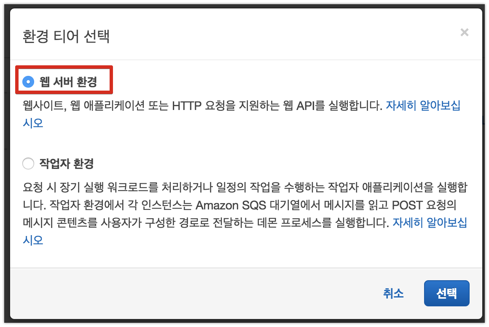

환경의 상세 정보를 등록해야하는데요.  
여기서 저는 도메인과 환경 이름을 external-api라고 정했습니다.  

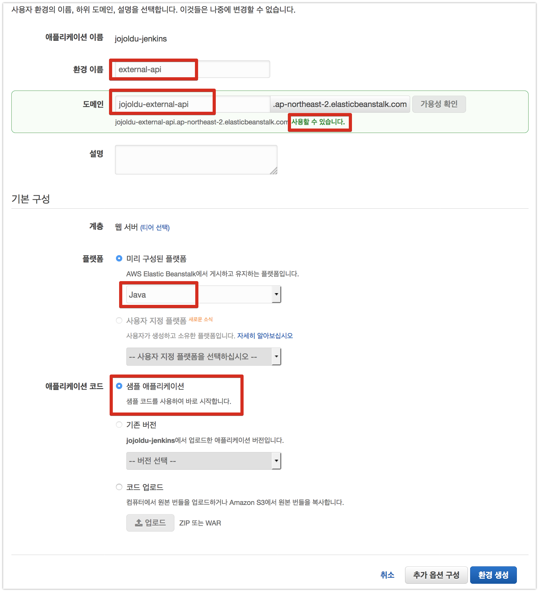

이렇게 한 이유는 간단합니다.  
이번 주제가 [Gradle Multi Module](http://jojoldu.tistory.com/123) 기반에서 Beanstalk을 어떻게 배포하느냐이기 때문입니다.  
현재 제가 배포할 프로젝트는 아래와 같이 프로젝트 하나에 서브 모듈 2개로 구성되어있습니다.  

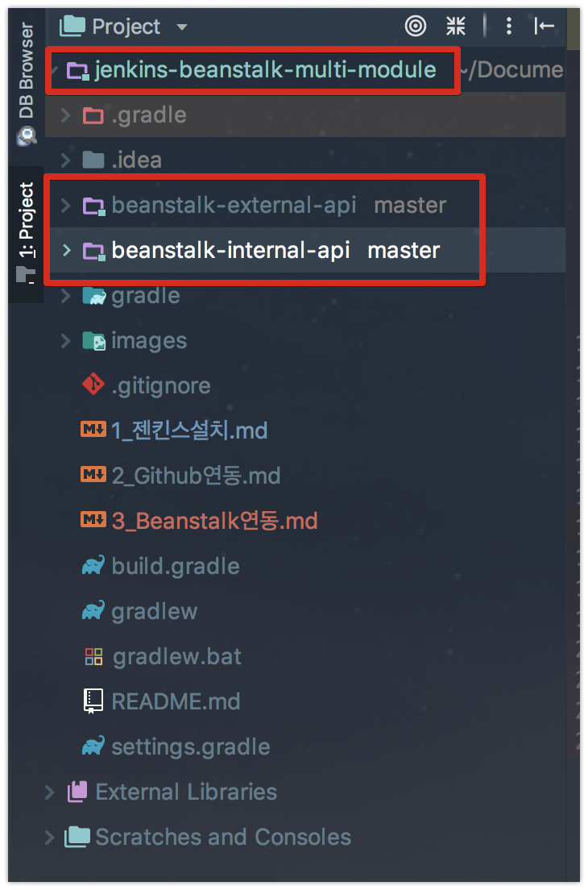

이들은 **각각 별도의 서버에 배포**되어서 서비스 되야 합니다.  
(external-api는 외부제공용 API, internal-api는 내부에서 사용할 API정도로 보시면 됩니다.)  
  
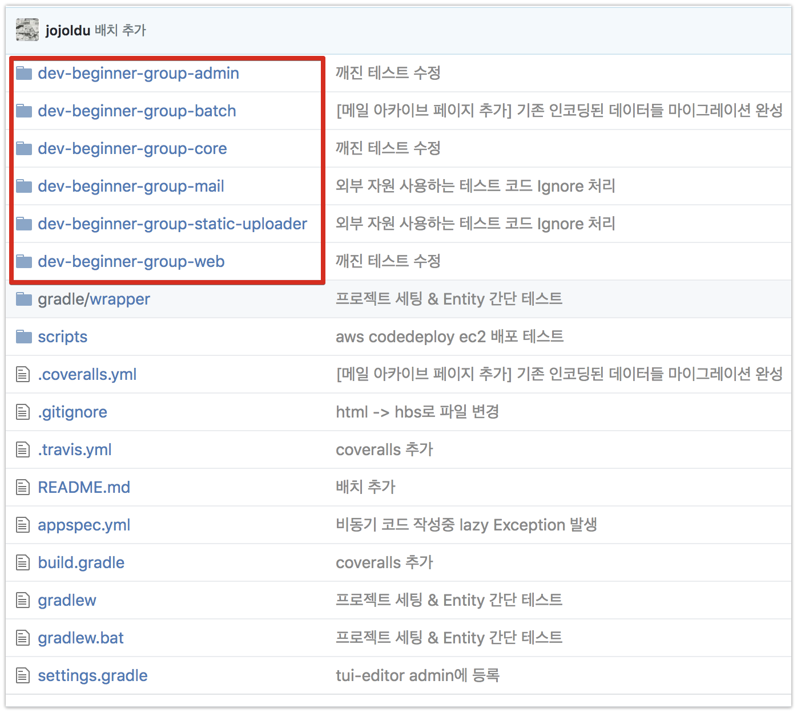

> 요즘 대부분의 프로젝트가 이런식으로 도메인을 구성하는 여러 프로젝트를 한곳에서 관리하되, 배포는 각각 별도의 서버로 하고 있으니 한번 경험삼아 구축해보시는것을 추천드립니다.

이번에 만들 Beanstalk은 **external-api가 배포될 환경**이라고 보시면 됩니다.  
Java를 선택하시고, 샘플 애플리케이션을 선택하신뒤 환경생성을 완료합니다.  
상태가 **확인**으로 뜨면 정상적으로 구축된 것입니다.

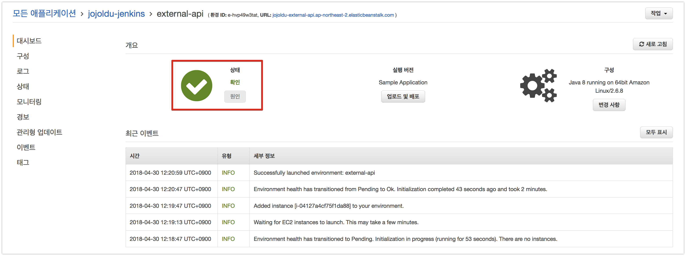

자 그럼 이렇게 구축된 Beanstalk 환경과 이전에 구축된 Jenkins를 연동하겠습니다.

## 3-2. Jenkins & Beanstalk 연동

전체 연동 구성은 아래와 같습니다.

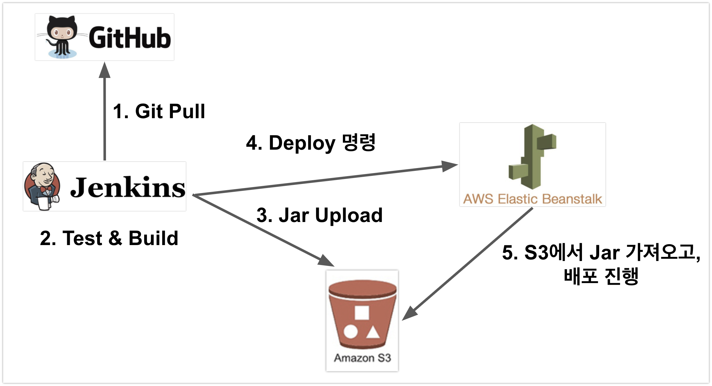

Jenkins에서는 Beanstalk과 연동하기 위해 2개의 기능이 추가되어야 합니다.

* Build 결과물인 Jar를 S3에 Upload
* S3에 업로드된 Jar를 이용해 배포하라는 명령을 Beanstalk에 전달

그럼 Jar를 업로드할 S3를 먼저 생성하겠습니다.

### S3 생성

서비스에서 S3를 검색해서 이동하신뒤, **버킷 만들기**를 클릭합니다.


이후 차례로 값을 입력하면서 생성하시면 됩니다.

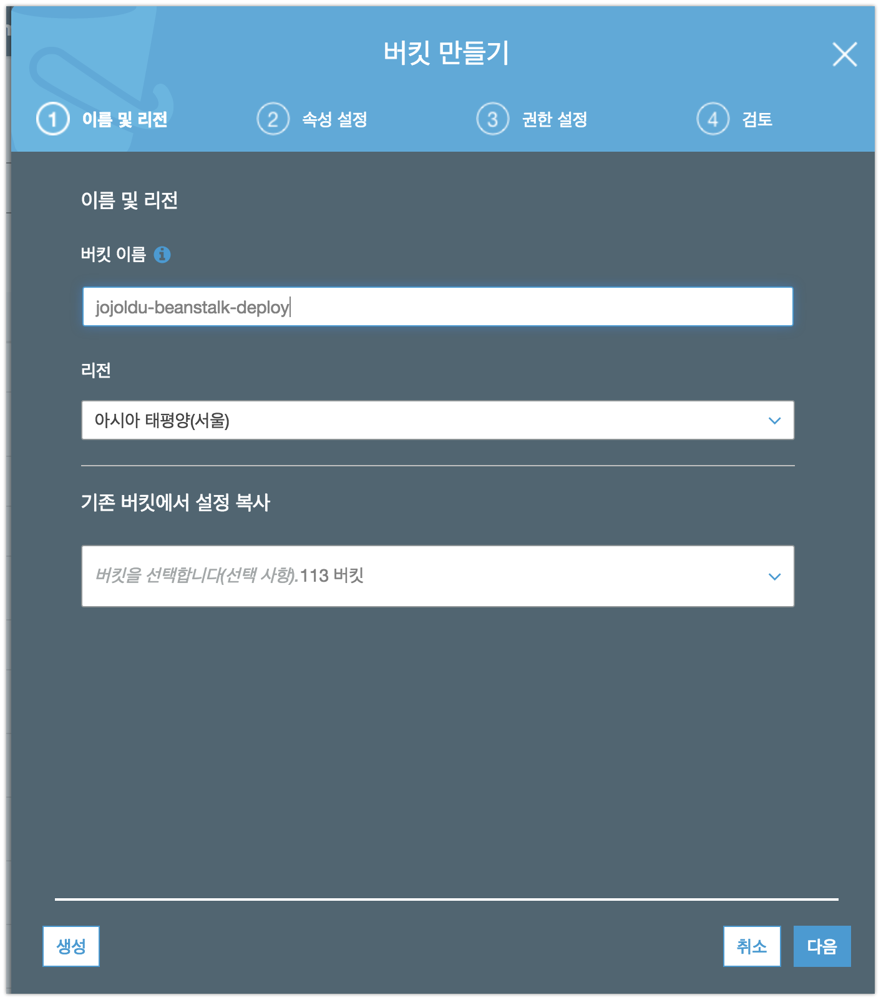


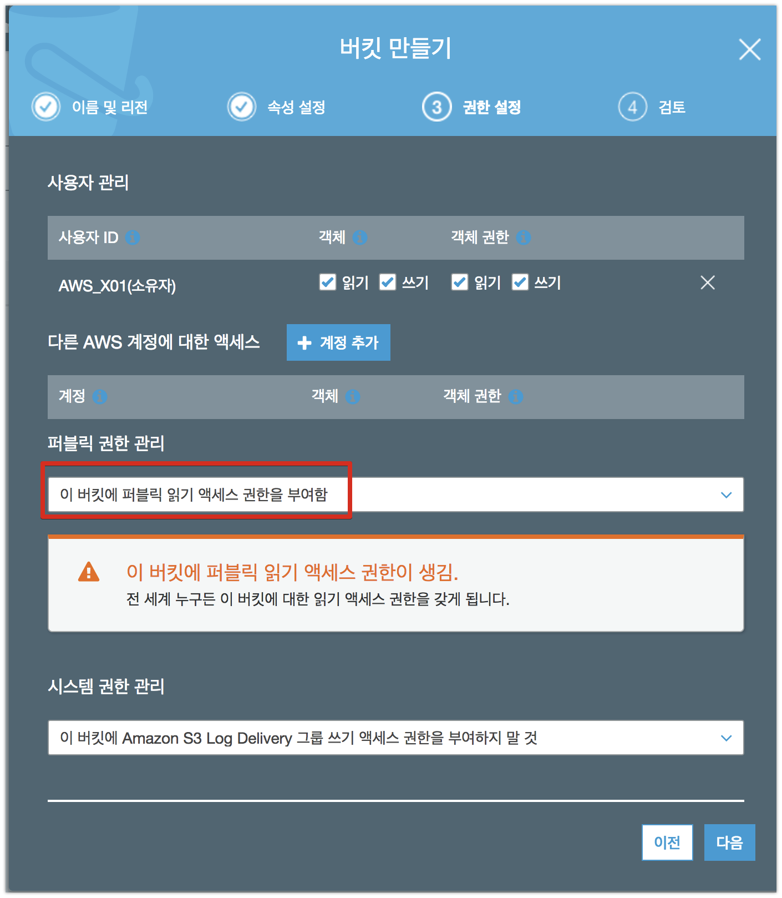


### Jenkins 빌드 추가

S3까지 준비되었으니, 실제 배포를 위한 Jenkins Item을 생성하겠습니다.

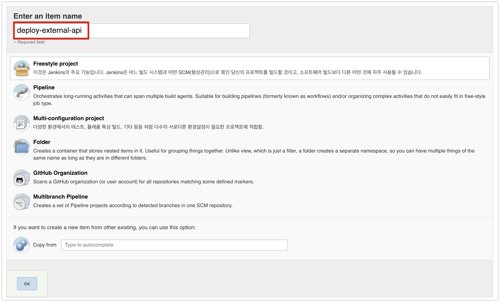

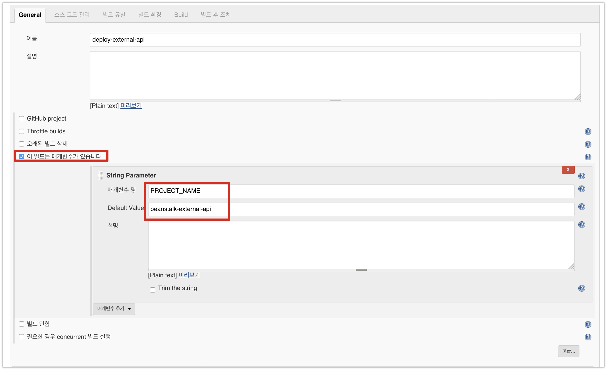

PROJECT_NAME 으로 지정된 값은 하단의 Build 과정에서 사용할 예정입니다.  

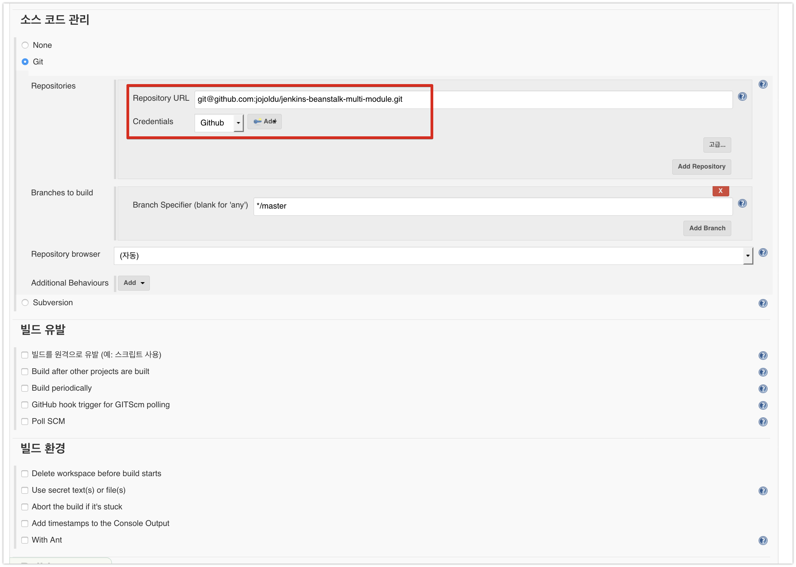

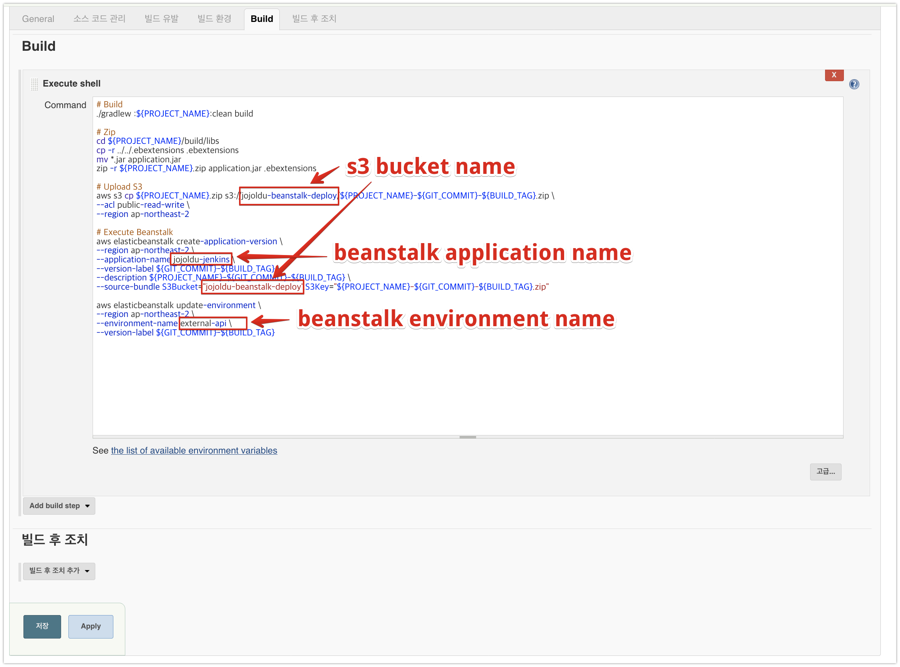

(전체 코드는 아래에 있습니다.)

```bash
# Build
./gradlew :${PROJECT_NAME}:clean build

# Zip
cd ${PROJECT_NAME}/build/libs
cp -r ../../.ebextensions .ebextensions
mv *.jar application.jar
zip -r ${PROJECT_NAME}.zip application.jar .ebextensions

# Upload S3
aws s3 cp ${PROJECT_NAME}.zip s3://jojoldu-beanstalk-deploy/${PROJECT_NAME}-${GIT_COMMIT}-${BUILD_TAG}.zip \
--acl public-read-write \
--region ap-northeast-2

# Execute Beanstalk
aws elasticbeanstalk create-application-version \
--region ap-northeast-2 \
--application-name jojoldu-jenkins \
--version-label ${GIT_COMMIT}-${BUILD_TAG} \
--description ${PROJECT_NAME}-${GIT_COMMIT}-${BUILD_TAG} \
--source-bundle S3Bucket="jojoldu-beanstalk-deploy",S3Key="${PROJECT_NAME}-${GIT_COMMIT}-${BUILD_TAG}.zip"

aws elasticbeanstalk update-environment \
--region ap-northeast-2 \
--environment-name external-api \
--version-label ${GIT_COMMIT}-${BUILD_TAG}
```

* ```./gradlew :${PROJECT_NAME}:clean build```
  * 여기서 맨위 매개변수 항목에서 지정한 PROJECT_NAME를 쓰고 있습니다.
  * 이 코드는 결국 ```./gradlew :beanstalk-external-api:clean build``` 로 수행됩니다.
  * 전체 build가 아닌, 배포 대상인 ```beanstalk-external-api```만 build 하기 때문에 build 시간 단축 & 다른 모듈 코드 변경에 영향을 받지 않는 장점이 있습니다.
* Zip